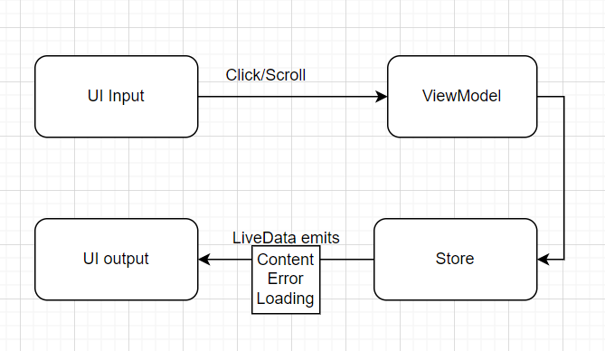

# Architecture
Unidirectional data flow in a function f(x) = y. Input is click, scroll, tap, hover with some specific 
params. ViewModel acts a function in a formula above. It's where all business happens. After processing,
data is emitted as an output to the UI layer. View can be android, ios, web. 
With the same input we can always expect the same output

# Project structure

| Module    | Description         |
|-----------|---------------------|
| home      | main feature        |  
| common    | common utility code | 
| resources | common assets       | 
| core-component | core architecture      | 
| app | ultimate module compile everything to final binary      | 

# Run unit test
`./gradlew testDebugUnitTest`

Assignment test mainly locates in app module

# Build
`./gradlew assembleDebug`
